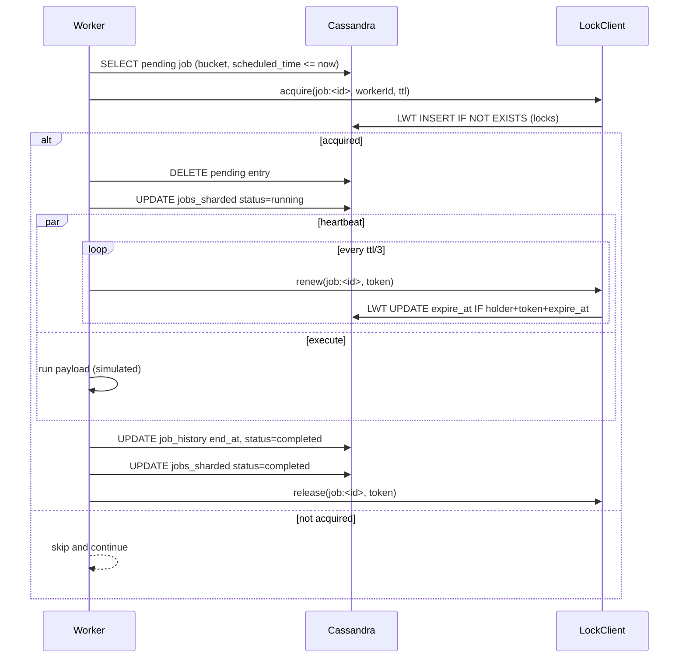
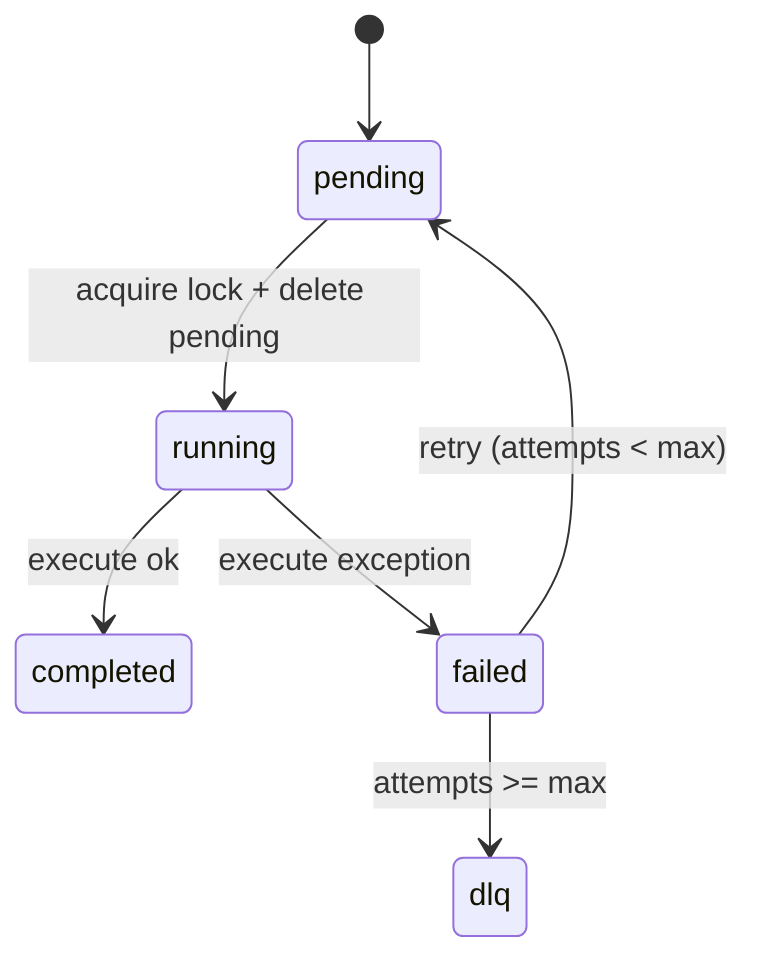
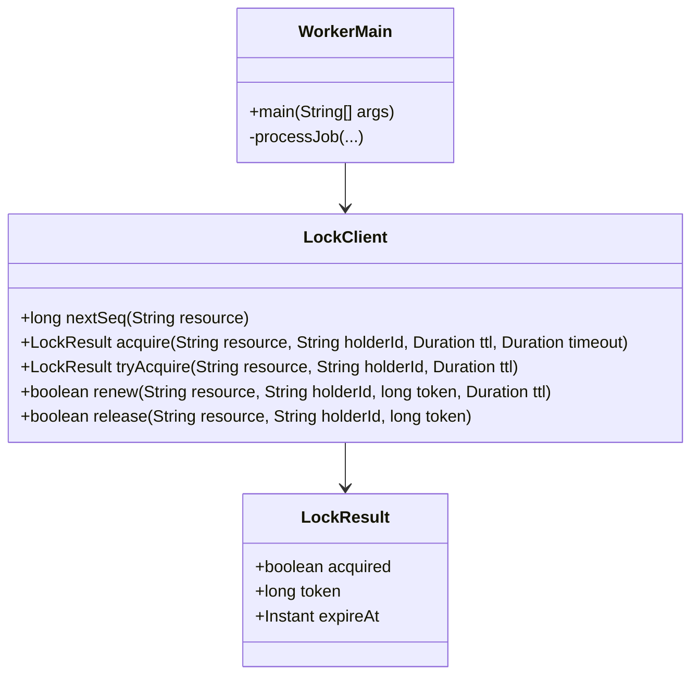
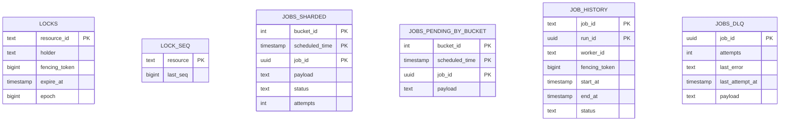

# BÁO CÁO ĐỒ ÁN
## Distributed Job Scheduler sử dụng Cassandra LWT + Distributed Locking (Fencing Token)

**Sinh viên:** …

**GVHD:** …

**Thời gian:** 01/2026

---

# Mục lục

1. [Tóm tắt đồ án (Abstract)](#tóm-tắt-đồ-án-abstract)
2. [MỞ ĐẦU (Problem Statement)](#mở-đầu-problem-statement)
3. [TỔNG QUAN (Overview / Background / Related Work)](#tổng-quan-overview--background--related-work)
4. [NGHIÊN CỨU LÍ THUYẾT / PHƯƠNG PHÁP (Model / Method / Solutions)](#nghiên-cứu-lí-thuyết--phương-pháp-model--method--solutions)
5. [TRÌNH BÀY, ĐÁNH GIÁ VÀ BÀN LUẬN (Evaluation / Experimental Results / Validation)](#trình-bày-đánh-giá-và-bàn-luận-evaluation--experimental-results--validation)
6. [KẾT LUẬN (Summary / Conclusion)](#kết-luận-summary--conclusion)
7. [HƯỚNG PHÁT TRIỂN (Future Work)](#hướng-phát-triển-future-work)
8. [TÀI LIỆU THAM KHẢO (References)](#tài-liệu-tham-khảo-references)
9. [PHỤ LỤC (Appendices)](#phụ-lục-appendices)

# Tóm tắt đồ án (Abstract)

Bài toán lập lịch và thực thi tác vụ nền (job scheduling) trong hệ thống phân tán luôn đi kèm các thách thức về **độ tin cậy**, **khả năng mở rộng**, và đặc biệt là **tính đúng** khi nhiều worker cùng tranh chấp để chạy cùng một job. Trong môi trường có lỗi (worker crash, network delay/partition, node backend giảm khả dụng), các chiến lược “best effort” dựa trên polling và update trạng thái đơn thuần thường dẫn đến các lỗi nghiêm trọng như **double execution** (job bị chạy đồng thời), hoặc **zombie worker** (worker cũ vẫn tiếp tục chạy và ghi kết quả sau khi bị thay thế).

Đồ án này nghiên cứu và hiện thực một **Distributed Job Scheduler** trong đó lớp **AP** đảm nhiệm luồng hàng đợi/job scheduling và lớp **CP** đảm nhiệm cơ chế **distributed locking an toàn** dựa trên Apache Cassandra. Điểm cốt lõi là sử dụng **Cassandra Lightweight Transactions (LWT)** – cơ chế Paxos của Cassandra – để thực hiện các thao tác có tính nguyên tử/linearizable trên khóa. Trên cơ chế LWT, đồ án áp dụng mô hình **fencing token** (token tăng đơn điệu) để ngăn chặn stale worker và bảo đảm thứ tự hiệu lực của người giữ lock.

Hướng tiếp cận chính của đồ án:

1. **Thiết kế schema Cassandra** cho locking và hàng đợi job theo hướng hạn chế hotspot và phục vụ polling theo shard/bucket.
2. Xây dựng **LockClient** (Java) cung cấp các primitive chuẩn: `acquire`, `renew`, `release`, `takeover` và cấp phát fencing token bằng LWT.
3. Xây dựng **Worker service** có REST API tối thiểu để tạo job, enqueue job vào hàng đợi sharded, và một vòng lặp poll + execute đảm bảo **at-most-once execution** ở mức job.
4. Bổ sung **observability** bằng Prometheus metrics và Grafana dashboard starter để theo dõi throughput, latency, lock contention và DLQ.

Kết quả đạt được trong repo hiện tại:

- **Locking core** dựa trên Cassandra LWT đã được hiện thực và có **integration tests** (Testcontainers) cho các tình huống tranh chấp đồng thời, takeover sau expiry, và tính đơn điệu/liên tục của fencing token.
- **Worker engine** đã có cơ chế polling theo bucket, backpressure, retry với exponential backoff + jitter, DLQ, health/ready endpoints, và Prometheus metrics.
- **Infra** có Docker Compose (Cassandra 3-node + Prometheus + Grafana + Worker + Postgres + Orders) và script áp schema.
- Hệ thống có thể chạy demo end-to-end bằng `scripts/start.sh`, `scripts/init_schema.sh`, `scripts/smoke_test.sh` theo hướng dẫn trong README.

Giới hạn hiện tại: đồ án đã có benchmark tối thiểu cho lock client nhưng chưa hoàn thiện bộ benchmark/chaos testing đầy đủ; AIOps (LLM-based RCA) mới ở mức ý tưởng/định hướng trong kế hoạch.

Đóng góp thực tiễn của đồ án đối với bài toán kỹ thuật phần mềm:

- Cung cấp một “skeleton” có thể tái sử dụng: schema Cassandra + lock client + worker loop + observability.
- Tập trung vào correctness: minh hoạ rõ sự khác biệt giữa “lock có TTL” và “lock có fencing token + takeover CAS”.
- Cho phép mở rộng thành pipeline nghiệp vụ (Orders → Payment → Fulfilment) như phần mở rộng trong repo.

---

# MỞ ĐẦU (Problem Statement)

## 1. Lý do chọn đề tài

Trong các hệ thống microservices hoặc hệ thống xử lý nền (background processing), job scheduler/worker là thành phần phổ biến (gửi email, xử lý thanh toán, đồng bộ dữ liệu, cron/delayed tasks, v.v.). Khi yêu cầu về **HA** và **scale ngang** tăng lên, việc triển khai worker theo mô hình “nhiều instance polling một queue” gặp bài toán kinh điển:

- Làm sao đảm bảo **một job không bị chạy đồng thời** khi nhiều worker cùng thấy job ở trạng thái pending?
- Khi worker chết giữa chừng, làm sao đảm bảo job **được chạy lại** (liveness) mà không tạo double execution?
- Khi hệ thống bị network delay/partition, làm sao tránh **split-brain** ở tầng lock?

Đây là bài toán phân tán yêu cầu kết hợp cả **tính đúng** và **khả năng vận hành**.

## 1.1. Phát biểu bài toán (Problem statement – formal hóa)

Cho một tập job $J = \{j_1, j_2, ..., j_n\}$, mỗi job có:

- `job_id`: định danh duy nhất.
- `scheduled_time`: thời điểm job đủ điều kiện chạy.
- `payload`: dữ liệu đầu vào phục vụ thực thi.

Hệ thống có nhiều worker song song $W = \{w_1, ..., w_k\}$, có thể xảy ra lỗi (crash/stop), có thể bị network delay/partition, và backend có thể giảm khả dụng tạm thời.

Yêu cầu chính:

- **Safety (at-most-once execution ở mức “critical section”):** tại mọi thời điểm, với cùng một `job_id`, không có 2 worker cùng “được phép” thực thi phần side-effect của job.
- **Liveness:** nếu job tới hạn và có worker khả dụng, job cuối cùng sẽ được xử lý (trừ khi backend sập kéo dài).
- **Operability:** có khả năng quan sát (metrics), chẩn đoán sự cố (logs/health), và tái lập môi trường.

## 2. Mục đích

- Thiết kế và hiện thực một scheduler/worker có thể chạy trong môi trường phân tán với nhiều worker.
- Đảm bảo **at-most-once execution** ở tầng job nhờ lớp locking CP.
- Minh họa rõ trade-off CAP: scheduler/queue có thể thiên về AP trong khi locking phải thiên về CP.
- Cung cấp hạ tầng và công cụ để tái lập (reproducible) hệ thống: docker compose + scripts + tests.

## 2.1. Kết quả mong đợi (Deliverables bám theo kế hoạch dự án)

- Docker Compose Cassandra 3-node và schema áp tự động.
- LockClient Java: acquire/renew/release/takeover + fencing token.
- Worker service: REST API tối thiểu + poll loop + retry/DLQ.
- Observability: metrics + dashboard.
- Benchmark/chaos (mục tiêu kế hoạch): bộ harness + report.
- Báo cáo kỹ thuật (tài liệu này) và hướng dẫn chạy demo.

## 3. Đối tượng và phạm vi nghiên cứu

### 3.1. Đối tượng

- Apache Cassandra và cơ chế LWT (Paxos).
- Distributed locking với fencing token.
- Worker polling và job lifecycle.
- Observability (Prometheus/Grafana).

Diễn giải cụ thể theo artefact trong repo:

- **Mô hình dữ liệu Cassandra** cho locking và queue: `locks`, `lock_seq`, `jobs_sharded`, `jobs_pending_by_bucket`, `job_history`, `jobs_dlq`.
- **Thư viện lock client** (Java) dùng DataStax Driver, cung cấp các primitive lock và token allocation.
- **Worker service** (Java) cung cấp API tối thiểu và vòng lặp poll/execute.
- **Hạ tầng chạy thử nghiệm**: Docker Compose (Cassandra x3, Prometheus, Grafana) và scripts áp schema.

### 3.2. Phạm vi

- Đồ án tập trung vào “hard-mode” lock + job execution: acquire/renew/takeover + fencing token + retry/DLQ.
- API được triển khai ở mức tối thiểu: tạo job, enqueue chạy ngay, query trạng thái.
- Không tập trung vào scheduler phức tạp (cron expression parser, multi-tenant fairness, priority queue nâng cao).

Những gì được xem là **in-scope** trong đồ án (được mô tả và/hoặc hiện thực trong repo):

- Thiết kế schema để hỗ trợ access pattern polling theo bucket và lock theo resource.
- Thuật toán lock an toàn dựa trên LWT (`IF NOT EXISTS`, `UPDATE IF`, `DELETE IF`) và takeover.
- Cơ chế gia hạn lock (heartbeat/renew) khi job chạy lâu.
- Pipeline xử lý job tối thiểu: pending → running → completed/failed + retry/backoff + DLQ.
- Observability cơ bản: metrics + dashboard starter + health/readiness.

Những gì là **in-scope ở mức thiết kế/định hướng** (có trong kế hoạch nhưng chưa hoàn thiện sản phẩm):

- Benchmark suite đầy đủ (low/medium/high contention) và báo cáo kết quả.
- Chaos testing (kill worker/node, delay/partition) và báo cáo.
- AIOps/RCA dựa trên LLM.

### 3.3. Các giả định và ràng buộc

- Giả định đồng hồ giữa các node/worker không lệch quá lớn (khuyến nghị NTP). Điều này quan trọng vì lock expire dựa trên `expire_at`.
- Job execution trong repo hiện tại là “placeholder/simulated” để tập trung vào cơ chế phân phối và locking.
- Cassandra cluster demo dùng `SimpleStrategy` (dev). Production cần `NetworkTopologyStrategy`.

Ràng buộc kỹ thuật và vận hành:

- Hệ thống ưu tiên tính **đúng** của locking hơn hiệu năng tuyệt đối; do đó chấp nhận chi phí LWT.
- Sử dụng Java 17 và Maven multi-module; môi trường demo chạy bằng Docker.
- Trên Windows cần Git Bash/WSL nếu muốn chạy các script `.sh`.

### 3.4. Phạm vi không nghiên cứu (Out of scope)

Để tránh lan man và đảm bảo tập trung vào core distributed systems, đồ án **không** (hoặc chưa) giải quyết các chủ đề sau ở mức sản phẩm hoàn chỉnh:

- **Cron scheduling nâng cao**: parser cron, misfire policy, calendar/holiday handling.
- **Multi-tenant & QoS**: isolation theo tenant, fairness, priority scheduling, rate limiting ở scheduler.
- **Exactly-once end-to-end**: transactional outbox đầy đủ, saga orchestration hoàn chỉnh cho payment/fulfilment.
- **Bảo mật production**: authentication/authorization, secret management, audit log, hardening.
- **Multi-DC production**: topology đa DC, strategy nhất quán theo DC, và các bài kiểm thử failover cross-DC.

### 3.5. Phạm vi đánh giá/kiểm chứng (Validation scope)

Đồ án tập trung đánh giá theo 3 nhóm tiêu chí:

- **Correctness**: không double-holder, takeover sau expiry, renew/release đúng theo holder/token.
- **Liveness cơ bản**: worker chết → lock hết hạn → worker khác takeover.
- **Operability**: có metrics/health/ready và khả năng tái lập môi trường chạy thử.

---

# TỔNG QUAN (Overview / Background / Related Work)

## 1. Các hướng tiếp cận phổ biến

### 1.1. Queue truyền thống với ACK/visibility timeout

Các hệ thống như SQS/RabbitMQ/Kafka-based consumer groups thường hỗ trợ một dạng “claim” và “ack”, hoặc visibility timeout. Tuy nhiên:

- Không phải lúc nào backend queue cũng sẵn có.
- Cần cơ chế chính xác để xử lý idempotency và double delivery.

### 1.2. Distributed Locking bằng Redis (Redlock)

Redis-based locks được dùng rộng rãi vì đơn giản và nhanh. Tuy nhiên Redlock có tranh luận lớn về tính đúng trong một số điều kiện mạng (delay/partition) và yêu cầu cấu hình cẩn thận.

### 1.3. Zookeeper/etcd (CP strong consistency)

Zookeeper và etcd cung cấp primitive CP rất mạnh, phù hợp cho locking/leader election. Trade-off là chi phí vận hành và integration.

### 1.4. Cassandra LWT

Cassandra thường được biết đến như hệ AP (tối ưu availability/scale), nhưng **LWT** cung cấp primitive “compare-and-set” dựa trên Paxos, cho phép xây dựng lock với tính nhất quán mạnh hơn so với write thường. Trade-off:

- LWT tốn chi phí cao (latency/throughput giảm khi contention).
- Cần schema và access pattern cẩn thận để tránh hotspot.

### 1.5. Fencing token và lý do cần thiết

Trong distributed lock, “có lock” chưa đủ để đảm bảo correctness nếu:

- Worker A giữ lock, bị stop-the-world GC hoặc network delay.
- Lock hết hạn, Worker B takeover và bắt đầu chạy.
- Worker A quay lại và vẫn tiếp tục ghi side-effect.

Fencing token giải quyết bằng cách tạo một số tăng đơn điệu gắn với “quyền thực thi”. Downstream system (hoặc chính worker) cần đảm bảo chỉ token lớn nhất mới hợp lệ.

Trong repo hiện tại, fencing token được ghi vào `job_history` như một artifact chứng minh thứ tự. Để hoàn chỉnh “end-to-end”, các thao tác side-effect (payment/fulfilment) nên kiểm tra token hoặc dùng idempotency key.

## 2. Vấn đề còn tồn tại

- Nhiều hệ thống “lock đơn giản” chỉ dùng TTL hoặc timestamp, dễ tạo ra stale holder.
- Khi worker crash giữa chừng, nếu không có **fencing token**, worker cũ có thể ghi kết quả trễ và làm hỏng state.
- Nếu thiết kế queue/table không sharding, polling có thể tạo hotspot nghiêm trọng.

## 3. Vấn đề đồ án tập trung giải quyết

- Cơ chế lock an toàn bằng LWT + fencing token.
- Takeover sau expiry và ngăn stale worker.
- Job queue sharded + worker polling + retry/DLQ.
- Observability đủ để vận hành demo.

## 4. Khoảng trống so với hệ thống production

- Chưa có scheduler “cron/delayed” nâng cao (parser, misfire policy).
- Chưa có multi-tenant isolation, priority scheduling, hoặc fairness.
- Chaos test và benchmark suite mới ở mức tối thiểu.
- Chưa có tracing/log aggregation/AIOps theo đúng mục tiêu giai đoạn cuối.

---

# NGHIÊN CỨU LÍ THUYẾT / PHƯƠNG PHÁP (Model / Method / Solutions)

## -1. Cơ sở lý thuyết (Background / Theory)

Phần này tổng hợp các nền tảng lý thuyết cốt lõi được sử dụng xuyên suốt đồ án. Mục tiêu là giải thích “vì sao thiết kế như vậy” và “những giả định nào cần đúng” để hệ thống hoạt động an toàn.

### -1.1. Hệ phân tán và các mô hình lỗi

Trong hệ phân tán, các thành phần (worker, database node, network) có thể gặp các lớp lỗi phổ biến:

- **Crash/stop:** tiến trình dừng đột ngột, mất state trong RAM.
- **Delay và timeout:** hệ thống vẫn chạy nhưng phản hồi chậm → client tưởng như “lỗi”.
- **Partition (mất kết nối một phần):** một nhóm node không liên lạc được với nhóm khác.
- **Clock skew:** đồng hồ các máy lệch nhau → các thuật toán dựa vào thời gian (lease/expire) có thể sai.

Trong đồ án, worker được giả định có thể crash và network có thể delay; do đó cần cơ chế đồng bộ/điều phối an toàn để tránh double execution.

### -1.2. CAP theorem và lựa chọn ưu tiên

CAP nói rằng khi có partition, hệ thống không thể đồng thời đảm bảo:

- **Consistency (C):** mọi node nhìn thấy dữ liệu nhất quán như nhau (theo nghĩa mạnh).
- **Availability (A):** mọi request đều nhận được phản hồi (không bị từ chối).
- **Partition tolerance (P):** hệ thống tiếp tục hoạt động dù mạng bị phân mảnh.

Trong thực tế, P là bắt buộc, nên bài toán là trade-off giữa C và A theo từng chức năng.

Đồ án chọn mô hình **Hybrid**:

- **Queue/Polling (AP-ish):** chấp nhận eventual consistency và “duplicate visibility” ở mức hàng đợi, miễn là lock bảo vệ correctness.
- **Locking (CP-ish):** ưu tiên consistency mạnh để tránh split-brain ở quyền thực thi.

### -1.3. Đồng thuận (Consensus) và Paxos (mức khái niệm)

Để có thao tác kiểu compare-and-set trong môi trường phân tán, backend cần một cơ chế đồng thuận. **Paxos** là một họ thuật toán đồng thuận, đảm bảo các node đạt được quyết định thống nhất ngay cả khi có lỗi/timeout nhất định.

Apache Cassandra triển khai **Lightweight Transactions (LWT)** dựa trên Paxos cho các câu lệnh dạng:

- `INSERT ... IF NOT EXISTS`
- `UPDATE ... IF <điều kiện>`
- `DELETE ... IF <điều kiện>`

LWT đắt hơn write thường (nhiều round-trip hơn), nhưng đổi lại cung cấp semantics gần với “atomic conditional update” cho một partition key.

### -1.4. Cassandra LWT: tuyến tính hoá theo partition và ý nghĩa “IF [applied]”

Trong Cassandra, điều kiện LWT được đánh giá và commit theo Paxos cho **một partition** (tức là một khóa phân vùng). Ứng dụng nhận kết quả thông qua cột đặc biệt `[applied]`:

- `[applied] = true`: thao tác điều kiện được commit.
- `[applied] = false`: điều kiện không thoả (hoặc có người khác thắng trong tranh chấp).

Đồ án dùng `[applied]` để:

- Bảo đảm **chỉ 1 worker acquire** lock.
- Bảo đảm **chỉ 1 worker takeover** khi lock hết hạn (CAS theo `epoch`).
- Bảo đảm cấp phát token tuần tự (CAS theo `last_seq`).

### -1.5. Lease-based locking và vấn đề thời gian (expire_at, TTL, clock skew)

**Lease** là lock có thời hạn: holder chỉ được coi là hợp lệ trong khoảng thời gian lease còn hiệu lực. Lease giúp giải quyết liveness: nếu holder chết, lease hết hạn và người khác có thể takeover.

Trong đồ án:

- Lock không dùng TTL để xoá row, mà lưu `expire_at` và kiểm tra ở ứng dụng.
- Worker heartbeat (renew) sẽ gia hạn lease khi job chạy lâu.

Rủi ro lý thuyết:

- Nếu clock skew lớn, một worker có thể đánh giá `expire_at` sai.
- Network delay/GC pause có thể làm renew bị trễ và lease hết hạn.

Khuyến nghị lý thuyết (production): đồng bộ NTP, chọn TTL đủ rộng, và nếu renew fail thì cần cơ chế abort để tránh stale execution.

### -1.6. Fencing token: ngăn stale worker và đảm bảo thứ tự hiệu lực

Fencing token là một số tăng đơn điệu gắn với mỗi lần acquire thành công. Khi có takeover, holder mới sẽ có token lớn hơn.

Nguyên lý:

- Holder chỉ “được phép” ghi side-effect nếu token của nó là **lớn nhất**.
- Downstream system (hoặc transaction layer) nên từ chối các request có token nhỏ hơn.

Trong đồ án, token được lưu trong `locks.fencing_token` và được ghi lại vào `job_history` như bằng chứng. Để hoàn chỉnh end-to-end, các tác vụ payment/fulfilment nên dùng token như một điều kiện idempotency hoặc ordering.

### -1.7. Nguyên tắc thiết kế dữ liệu Cassandra (Data modeling)

Khác với RDBMS, Cassandra yêu cầu thiết kế theo access pattern:

- **Partition key** quyết định phân tán dữ liệu; partition quá “nóng” → hotspot.
- **Clustering key** phục vụ query theo thứ tự và range scan trong cùng partition.
- Tránh `ALLOW FILTERING`; nếu cần query dạng “index”, thường tạo bảng phục vụ query đó.

Đồ án áp dụng:

- Bucketing (`bucket_id`) để phân tán polling.
- Bảng pending riêng để đọc theo `scheduled_time <= now`.

### -1.8. Retry, exponential backoff và jitter

Khi nhiều worker tranh chấp (đặc biệt LWT), nếu retry ngay lập tức sẽ tạo **thundering herd**. Vì vậy dùng:

- **Exponential backoff:** tăng thời gian chờ theo cấp số nhân.
- **Jitter:** thêm nhiễu ngẫu nhiên để tránh đồng bộ hoá retry.

Điều này là thực hành chuẩn trong distributed systems để giảm contention và cải thiện throughput tổng thể.

### -1.9. Observability: metrics, health/readiness và vận hành

Trong hệ phân tán, lỗi thường không “rõ ràng”, cần quan sát liên tục.

- **Metrics:** đo throughput, latency, error rates để phát hiện suy giảm.
- **Health check:** kiểm tra “còn sống” (liveness) và “sẵn sàng” (readiness).

Đồ án dùng Prometheus metrics + Grafana dashboard để theo dõi lock LWT latency, renew failure, jobs in progress và DLQ.

### -1.10. Idempotency và đúng đắn end-to-end

Ngay cả khi lock đúng, hệ thống thực tế vẫn cần **idempotency** để chống duplicate delivery do retry/timeouts:

- Ở tầng API (ví dụ Orders), idempotency key đảm bảo “gọi lại” trả kết quả cũ.
- Ở tầng job handler, nếu side-effect (payment/shipping) có thể bị retry, cần idempotency hoặc transactional outbox.

Trong repo hiện tại, Orders service đã minh hoạ idempotency key và optimistic locking inventory trên Postgres; phần payment/fulfilment là hướng phát triển tiếp.

## 0. Yêu cầu chức năng (Functional Requirements)

FR-1. Tạo job: client tạo job với payload và thông tin schedule.

FR-2. Enqueue job: đưa job vào hàng đợi để worker xử lý.

FR-3. Poll và xử lý: worker quét hàng đợi, claim job và thực thi.

FR-4. Không chạy đồng thời: cùng một `job_id` không được chạy đồng thời.

FR-5. Crash recovery: worker chết → job được worker khác takeover sau expiry.

FR-6. Retry & DLQ: job lỗi được retry có backoff; quá ngưỡng thì vào DLQ.

FR-7. Observability: có metrics và health/readiness.

## 0.1. Yêu cầu phi chức năng (NFR)

NFR-1. **High availability:** hệ thống tiếp tục chạy khi 1 worker chết; Cassandra demo 3 node.

NFR-2. **Consistency cho locking:** tránh split-brain ở tầng lock.

NFR-3. **Scalability:** tăng số worker tăng throughput gần tuyến tính (khi contention thấp).

NFR-4. **Operability:** có metrics, dashboard, health checks và script tái lập.

NFR-5. **Simplicity:** ưu tiên thiết kế đơn giản, có thể đọc/giải thích rõ.

## 1. Mô hình CAP và lựa chọn thiết kế

Trong hệ phân tán, CAP theorem cho rằng trong điều kiện có partition, không thể đồng thời đảm bảo (C)onsistency và (A)vailability.

Trong đồ án:

- **Scheduler/queue (AP layer):** ưu tiên availability và scale ngang. Việc enqueue/poll có thể chấp nhận eventual consistency ở mức “job xuất hiện/biến mất” miễn là tầng lock đảm bảo correctness.
- **Locking (CP layer):** yêu cầu consistency mạnh để tránh split-brain và double execution. Vì vậy dùng **Cassandra LWT** để có compare-and-set theo Paxos.

### 1.1. Phân tích “Hybrid AP/CP” trong đồ án

- Tầng queue/polling chịu trách nhiệm “đưa job tới worker” và có thể chấp nhận duplicate visibility (một job có thể được nhiều worker nhìn thấy trong một khoảng ngắn), vì correctness cuối cùng được bảo đảm bởi lock.
- Tầng lock là điểm chốt correctness, cần hành vi giống linearizable compare-and-set.

### 1.2. Vì sao dùng Cassandra LWT (thay vì TTL đơn thuần)

- TTL đơn thuần chỉ cho “expire eventually”; không giải quyết tranh chấp takeover đồng thời.
- LWT cung cấp điều kiện `IF` với Paxos giúp đảm bảo tại một thời điểm chỉ có một update được áp dụng.
- LWT cho phép triển khai CAS trên `epoch` và `lock_seq`.

## 2. Kiến trúc tổng thể

Thành phần chính theo repo:

- `client-lib/`: Lock client Java, cung cấp acquire/renew/release/takeover + fencing token.
- `worker/`: Worker HTTP service, đồng thời đóng vai trò API tối thiểu và poll loop thực thi job.
- `infra/`: Docker Compose (Cassandra x3, Prometheus, Grafana, worker, postgres, orders) + schema.
- `scripts/`: scripts start/stop stack, apply schema, smoke test.
- `orders/`: dịch vụ ví dụ (Orders) sử dụng idempotency + optimistic locking trên Postgres và best-effort enqueue payment job vào worker.

### 2.1. Sơ đồ kiến trúc (Mermaid)

```mermaid
flowchart LR
  Client[Client] -->|REST| WorkerAPI[Worker HTTP API]
  WorkerAPI -->|enqueue| Cassandra[(Cassandra)]
  WorkerLoop[Worker Poller Loop] -->|poll pending jobs| Cassandra
  WorkerLoop -->|acquire/renew/release| LockClient[LockClient]
  LockClient -->|LWT Paxos| Cassandra

  Cassandra -->|metrics scrape| Prometheus[(Prometheus)]
  Prometheus --> Grafana[Grafana]

  Orders[Orders Service (Postgres)] -->|best-effort enqueue payment job| WorkerAPI
  Orders --> Postgres[(Postgres)]
```

Ghi chú: repo hiện tại “worker” kiêm cả phần API và poller. Trong roadmap có thể tách Scheduler service riêng nếu cần.

### 2.2. Biên giới trách nhiệm (Boundaries)

- `LockClient`: chỉ làm locking (LWT), không biết “job semantics”.
- `WorkerMain`: orchestration của polling + state machine + observability.
- `Orders`: ví dụ nghiệp vụ để tạo nhu cầu enqueue job (payment).

## 3. Thiết kế schema Cassandra

Schema nằm ở `infra/schema.cql`.

### 3.0. Nguyên tắc thiết kế schema Cassandra được áp dụng

1) **Truy vấn quyết định schema:** tránh `ALLOW FILTERING`; tạo bảng phục vụ access pattern.

2) **Tránh hot partition:** phân tán writes/reads bằng bucketing/sharding.

3) **Hạn chế tombstones:** tránh TTL sai chỗ, hạn chế delete hàng loạt; chọn compaction phù hợp.

4) **Cẩn trọng với LWT:** LWT có chi phí cao; giảm tần suất bằng Hi/Lo và sharding khi cần.

### 3.1. Bảng `locks` (CP layer)

Mục tiêu: lưu lock theo `resource_id`, có khả năng takeover khi hết hạn và có fencing token.

Các cột chính:

- `resource_id` (PK): tài nguyên cần khóa, ví dụ `job:<uuid>`.
- `holder`: worker đang giữ lock.
- `fencing_token`: token tăng đơn điệu; worker dùng token để đảm bảo thứ tự hiệu lực.
- `expire_at`: thời điểm hết hạn lock (không dùng TTL row-level để tránh LWT+TTL pitfalls).
- `epoch`: dùng cho takeover sequencing; takeover tăng epoch bằng CAS.

Cấu hình:

- Compaction `TimeWindowCompactionStrategy` (TWCS) + `gc_grace_seconds = 60` phù hợp với workload update theo thời gian và giảm ảnh hưởng tombstone.

Giải thích thêm:

- **Vì sao không dùng TTL trên row lock:** TTL kết hợp LWT có thể tạo nhiều tombstones và các corner-case khi “row vừa expire” nhưng các replica không đồng bộ thời điểm; do đó repo chọn cách lưu `expire_at` và kiểm tra expire ở ứng dụng.
- **Vì sao cần `epoch`:** takeover dựa trên “đọc expire rồi update” nếu không có CAS guard thì 2 worker có thể cùng thấy expired và cùng cố takeover. CAS trên epoch đảm bảo chỉ một takeover thắng.

### 3.2. Bảng cấp phát token `lock_seq`

`lock_seq(resource PRIMARY KEY, last_seq)` dùng CAS để tăng `last_seq`.

Trong code, token allocation dùng Hi/Lo block (`LOCK_SEQ_BLOCK_SIZE`) để giảm tần suất LWT.

Giải thích Hi/Lo trong bối cảnh Cassandra:

- Nếu mỗi lần acquire đều increment token bằng LWT, `lock_seq` trở thành hot partition.
- Hi/Lo “mua sỉ” một đoạn token (block) bằng LWT, sau đó cấp phát trong RAM.
- Trade-off: nếu process crash, có thể “mất” phần token chưa dùng (gây gap). Repo hiện tại có test continuity cho một run; trong thực tế, chấp nhận gap là bình thường và không làm sai correctness.

### 3.3. Queue sharded: `jobs_sharded` và `jobs_pending_by_bucket`

- `jobs_sharded`: lưu trạng thái job theo bucket + scheduled_time + job_id.
- `jobs_pending_by_bucket`: view pending per bucket để poll `scheduled_time <= now()`.

Thiết kế này tránh ALLOW FILTERING và giảm hotspot bằng bucketing.

Chi tiết thiết kế khóa:

- `bucket_id` là partition key: mục tiêu là phân tán polling và writes trên nhiều partition.
- `scheduled_time` là clustering key: cho phép query “tới hạn” bằng điều kiện `scheduled_time <= now` trong từng bucket.
- `job_id` là tie-breaker để tránh collision.

Lý do tồn tại 2 bảng:

- `jobs_sharded` lưu đầy đủ trạng thái/attempts.
- `jobs_pending_by_bucket` đóng vai trò “pending index” để poll nhanh theo thời gian; khi job được claim thì delete khỏi pending.

### 3.4. Job history: `job_history`

Lưu log chạy job theo `job_id` và `run_id` để có thể query lịch sử và trạng thái run gần nhất.

Giải thích thiết kế:

- `run_id` là clustering key để có thể ghi nhiều lần chạy cho một job.
- Dùng như event log tối thiểu phục vụ debug và demo.

### 3.5. DLQ: `jobs_dlq`

Lưu các job vượt quá số lần retry.

Gợi ý mở rộng (production):

- DLQ nên lưu thêm error classification, stacktrace rút gọn, và correlation id.
- Có thể thêm “re-drive” endpoint để đưa DLQ trở lại queue.

### 3.6. Lưu ý về lỗi schema/duplicate

Trong `infra/schema.cql` hiện có khai báo `lock_seq_shard` lặp lại 2 lần. Điều này không làm schema apply bị fail (vì `IF NOT EXISTS`), nhưng nên dọn để tránh nhầm lẫn trong báo cáo/đánh giá.

## 3.7. Consistency Level (CL) và Serial Consistency (khuyến nghị)

Trong mã nguồn hiện tại, các statement không set CL/serial CL explicit; driver sẽ dùng mặc định. Đối với hệ production, nên chuẩn hoá CL theo loại thao tác:

- **Lock LWT (acquire/renew/release/takeover):** dùng serial consistency `LOCAL_SERIAL` (hoặc `SERIAL`) và write consistency `QUORUM` (hoặc `LOCAL_QUORUM` nếu multi-DC).
- **Queue enqueue/poll (không LWT):** thường `LOCAL_QUORUM` cho write và read để cân bằng consistency/availability.
- **Read job status/history:** `LOCAL_QUORUM` hoặc `ONE` tùy yêu cầu hiển thị.

Mục tiêu: lock ưu tiên consistency, queue ưu tiên availability/throughput.

## 4. Thiết kế Distributed Locking (LWT + Fencing Token)

### 4.1. Yêu cầu correctness

- Không xảy ra double-holder cho cùng `resource_id`.
- Khi lock hết hạn, worker khác takeover được.
- Worker cũ (stale) không được phép “ghi đè” kết quả nếu token thấp hơn.

### 4.2. Primitive API trong `LockClient`

`LockClient` triển khai:

- `nextSeq(resource)`: cấp token tăng đơn điệu.
- `acquire(resource, holderId, ttl, timeout)`:
  - Thử `INSERT ... IF NOT EXISTS`.
  - Nếu thất bại, đọc lock; nếu expired thì takeover bằng `UPDATE ... IF epoch = ?` với epoch++.
- `renew(resource, holderId, token, ttl)`:
  - Read current lock để check owner/token/expire_at.
  - CAS update expire_at với điều kiện holder+token+expire_at cũ.
- `release(resource, holderId, token)`:
  - `DELETE ... IF holder = ? AND fencing_token = ?`.

### 4.2.1. Pseudocode chi tiết

**Acquire (blocking, có timeout):**

```text
deadline = now + timeout
backoff = 50ms
while now < deadline:
  token = nextSeq(resource)
  expireAt = now + ttl

  if INSERT locks(resource_id, holder, token, expireAt, epoch=0) IF NOT EXISTS applied:
     return acquired(token, expireAt)

  cur = SELECT holder, token, expire_at, epoch FROM locks WHERE resource_id=resource
  if cur.expire_at <= now:
     nextEpoch = cur.epoch + 1
     if UPDATE locks SET holder=?, token=?, expire_at=?, epoch=nextEpoch IF epoch=cur.epoch applied:
        return acquired(token, expireAt)

  sleep(backoff + jitter)
  backoff = min(2s, backoff*2)
return not_acquired
```

**Renew:**

```text
cur = SELECT holder, token, expire_at, epoch FROM locks WHERE resource_id=resource
if cur.holder != holderId or cur.token != token or cur.expire_at <= now:
  return false
newExpire = now + ttl
return UPDATE locks SET expire_at=newExpire IF holder=? AND token=? AND expire_at=cur.expire_at applied
```

**Release:**

```text
return DELETE FROM locks WHERE resource_id=? IF holder=? AND token=? applied
```

### 4.3. Thuật toán cấp fencing token (Hi/Lo)

Mục tiêu: giảm contention trên `lock_seq` bằng cách xin “block” token.

- Nếu row chưa có: `INSERT IF NOT EXISTS last_seq = blockSize` → token 1..blockSize.
- Nếu row có: CAS `UPDATE last_seq = old + blockSize IF last_seq = old`.

### 4.3.1. Pseudocode cấp block

```text
if localBlock(resource) còn token:
  return next

if INSERT lock_seq(resource, last_seq=blockSize) IF NOT EXISTS applied:
  localBlock = [1..blockSize]
  return 1

repeat:
  old = SELECT last_seq FROM lock_seq WHERE resource
  nextLast = old + blockSize
  if UPDATE lock_seq SET last_seq=nextLast IF last_seq=old applied:
     localBlock = [old+1 .. nextLast]
     return old+1
  sleep(backoff+jitter)
```

### 4.4. Takeover theo `epoch`

Khi lock expired, takeover thực hiện CAS:

`UPDATE locks SET holder=?, fencing_token=?, expire_at=?, epoch=? WHERE resource_id=? IF epoch=?`

Điều này tránh tình huống 2 worker cùng takeover dựa trên stale read.

### 4.5. Backoff + jitter

Acquire có retry loop với exponential backoff và jitter để giảm herd effect.

## 4.6. Lập luận an toàn (Safety argument – phác thảo)

Mục tiêu cần chứng minh: với cùng `resource_id`, không thể có hai holder “cùng được phép” thực thi.

1) **Mutual exclusion ở thời điểm acquire:**

- LWT `INSERT ... IF NOT EXISTS` đảm bảo chỉ một request tạo row locks.
- Takeover dùng CAS trên `epoch` đảm bảo tại một thời điểm chỉ một takeover thắng.

2) **Stale worker bị chặn:**

- Worker cũ có token nhỏ hơn worker mới.
- Khi renew/release đều yêu cầu holder/token match (và renew còn yêu cầu expire_at match), do đó stale worker không thể kéo dài lock hoặc xoá lock của holder mới.

3) **Cảnh báo về side-effect:**

- Fencing token chỉ phát huy đầy đủ khi downstream side-effect kiểm tra token/idempotency.
- Repo hiện tại minh hoạ bằng cách ghi token vào `job_history`, và khuyến nghị future work cho payment/fulfilment.

## 5. Worker engine và job lifecycle

`worker` triển khai:

- REST API:
  - `POST /jobs`: tạo job và enqueue ngay.
  - `GET /jobs/{id}`: query job cơ bản + trạng thái run gần nhất.
  - `POST /jobs/{id}/run`: enqueue để chạy.
  - `GET /metrics`, `GET /healthz`, `GET /readyz`.

- Poll loop:
  - Duyệt bucket round-robin.
  - Query `jobs_pending_by_bucket` với `scheduled_time <= now`.
  - Với mỗi job: acquire lock `job:<jobId>`.
  - Delete khỏi pending để tránh pickup trùng.
  - Update status running/completed/failed.
  - Retry với exponential backoff + jitter; quá max attempts → DLQ.

### 5.1. Sequence diagram (Mermaid)



### 5.2. Backpressure

Worker giới hạn số job đồng thời bằng `WORKER_MAX_IN_PROGRESS`.

### 5.3. Retry & DLQ

Nếu job fail:

- Tăng attempts.
- Nếu attempts <= max → enqueue lại vào `jobs_pending_by_bucket` với `nextTime = now + delay*jitter`.
- Nếu vượt max → insert vào `jobs_dlq` và set status `dlq`.

## 5.4. State machine chi tiết

Trong repo, trạng thái được lưu trong `jobs_sharded.status`. Có thể mô tả state machine:



Giải thích từng transition:

- `pending → running`: chỉ xảy ra sau khi acquire lock thành công. Delete khỏi `jobs_pending_by_bucket` là bước “claim” để giảm pickup trùng.
- `running → completed/failed`: cập nhật `job_history` và status.
- `failed → pending`: enqueue lại vào pending với `scheduled_time` mới (backoff+jitter).
- `failed → dlq`: insert vào `jobs_dlq` và đánh dấu `dlq`.

## 5.5. Các failure mode và cách xử lý

### 5.5.1. Worker crash trước khi delete pending

- Tình huống: Worker acquire lock xong thì crash.
- Kết quả: pending entry vẫn còn; worker khác thấy pending nhưng sẽ không acquire lock cho tới khi expire.
- Sau expire: worker khác takeover và chạy.

### 5.5.2. Worker crash sau khi delete pending nhưng trước khi update status

- Pending đã bị xoá nên worker khác không thấy job trong pending.
- Nhưng job vẫn tồn tại trong `jobs_sharded` và lock sẽ expire.
- Đây là khoảng trống cần xử lý trong production bằng một cơ chế “reconciler”/“scanner” để quét các job stuck ở `running` quá lâu và đưa lại pending.

Repo hiện tại tập trung demo flow và locking; reconciler là mục tiêu mở rộng.

### 5.5.3. Heartbeat renew fail

- Repo hiện tại log warning và job vẫn tiếp tục chạy.
- Production khuyến nghị: nếu renew fail, phải **abort** hoặc chuyển sang “safe mode” để tránh stale worker chạy quá lâu.

## 6. Observability

### 6.1. Prometheus metrics

Worker expose `/metrics` với:

- `jobs_processed_total{status}`
- `jobs_in_progress`
- `job_duration_seconds` histogram
- `jobs_dlq_total`

Lock metrics (Prometheus-backed `LockMetrics`):

- `lock_acquire_attempt_total`
- `lock_acquire_success_total`
- `lock_takeover_success_total`
- `lock_renew_success_total`, `lock_renew_failure_total`
- `lock_release_success_total`, `lock_release_failure_total`
- `lwt_latency_seconds{op}` histogram

Giải thích cách dùng metrics để vận hành:

- `lwt_latency_seconds{op}` tăng mạnh ở p99 thường là dấu hiệu contention hoặc node Cassandra chậm.
- `lock_renew_failure_total` tăng bất thường có thể do clock skew, GC pause, hoặc Cassandra timeout.
- `jobs_in_progress` chạm ngưỡng `WORKER_MAX_IN_PROGRESS` kéo dài là dấu hiệu saturation.
- `jobs_dlq_total` spike báo hiệu job handler có lỗi hoặc backend phụ thuộc lỗi.

### 6.2. Grafana dashboard

Repo có starter dashboard: `infra/grafana/dashboards/job_scheduler_overview.json`.

### 6.3. Health & readiness

- `/healthz`: query nhẹ Cassandra; trả 503 nếu Cassandra lỗi.
- `/readyz`: báo ready sau khi server + poller init.

---

# TRÌNH BÀY, ĐÁNH GIÁ VÀ BÀN LUẬN (Evaluation / Experimental Results / Validation)

Phần này trình bày ngắn gọn các công việc nghiên cứu/kỹ thuật đã tiến hành, các kết quả thực nghiệm thu được, và hồ sơ thiết kế – cài đặt của sản phẩm phần mềm (theo các mô hình/biểu đồ đã học).

## 0. Tóm tắt công việc nghiên cứu đã tiến hành

Các nhóm công việc chính đã được thực hiện trong đồ án và được kiểm chứng bằng artefact trong repo:

1) **Nghiên cứu tài liệu và lựa chọn phương pháp**

- Chọn hướng tiếp cận “Hybrid AP/CP”: queue/polling thiên về availability, locking thiên về correctness.
- Chọn Cassandra LWT (Paxos) để hiện thực thao tác CAS trên cùng một partition key.

2) **Thiết kế dữ liệu và đặc tả access pattern**

- Thiết kế bảng `locks` cho lock theo `resource_id` và lease (`expire_at`) + `epoch` takeover.
- Thiết kế `lock_seq` để cấp fencing token theo mô hình Hi/Lo (giảm tần suất LWT).
- Thiết kế queue sharded theo `bucket_id` + `scheduled_time`, kèm bảng “pending index” phục vụ polling.

3) **Hiện thực sản phẩm phần mềm**

- Hiện thực thư viện `LockClient` (Java) cung cấp primitive: acquire/renew/release/takeover + token allocation.
- Hiện thực `worker` service (Java) gồm REST API tối thiểu + poll loop + retry/DLQ + health/ready + metrics.

4) **Thực nghiệm/kiểm chứng**

- Integration tests cho locking core với Testcontainers (Cassandra 3.11 container), mô phỏng tranh chấp và takeover.
- Smoke test end-to-end (infra + worker + schema) để kiểm tra đường chạy tối thiểu và quan sát metrics.
- Benchmark tối thiểu ở mức “khung chạy” (hướng dẫn cách chạy, template kết quả).

## 1. Môi trường thực nghiệm

- Java 17
- Maven multi-module
- Cassandra 3.11 (Docker)
- Prometheus + Grafana (Docker)

Khuyến nghị tái lập:

- Chạy bằng Docker Compose trong `infra/` để đảm bảo đúng networking.
- Trên Windows cần Git Bash/WSL để chạy scripts `.sh`.

## 2. Kịch bản kiểm thử tính đúng (Correctness)

### 2.1. Lock integration tests (Testcontainers)

Các test hiện có trong `client-lib`:

- **Tranh chấp 2 client:** chỉ 1 client acquire thành công.
- **Takeover sau expiry:** worker2 acquire sau khi worker1 hết hạn; worker1 renew fail.
- **Renew thành công rồi fail sau expiry:** verify renew counter.
- **Token monotonic/continuous under concurrency:** `nextSeq` cho ra tập token liên tục, không trùng.

Cách chạy (Windows):

Ghi chú: cần cài Apache Maven và đảm bảo lệnh `mvn` có trong PATH.

```bat
cd /d d:\Code\da1\job_scheduler
mvn -q -pl client-lib verify
```

Kết quả thực nghiệm đã có trong artefact (kết quả lần chạy gần nhất lưu ở `client-lib/target/failsafe-reports/`):

- `failsafe-summary.xml`: **completed=4, errors=0, failures=0, skipped=0**.
- `TEST-com.example.lock.LockClientIT.xml`: **3 test cases, 0 failures** (các ca kiểm thử chính: `raceOnlyOneAcquires`, `takeoverAfterExpire`, `renewSuccessThenFailAfterExpiry`).
- `TEST-com.example.lock.LockSeqHiLoIT.xml`: **1 test case, 0 failures** (kiểm chứng `nextSeq_isContinuous_andUnique_underConcurrency`).

Ý nghĩa khi test pass:

- Chứng minh cơ chế LWT `IF NOT EXISTS` và CAS takeover hoạt động đúng trong môi trường Cassandra container.
- Chứng minh renew tuân theo owner/token/expire_at (stale renew bị fail).
- Chứng minh token allocation không tạo trùng dưới concurrency.

### 2.2. Smoke test end-to-end

Repo có `scripts/smoke_test.sh` mô tả kiểm tra:

1) stack start
2) schema applied
3) tạo job và enqueue
4) job_history được ghi
5) metrics accessible

Kỳ vọng quan sát sau smoke test:

- `/metrics` có các metric `jobs_processed_total`, `lwt_latency_seconds`.
- `job_history` có record `running` → `completed`.

## 3. Kịch bản kiểm thử liveness / failure

Trong repo hiện tại, liveness được chứng minh ở mức:

- TTL/expire_at + takeover epoch cho phép worker khác acquire khi worker chết.
- Worker có heartbeat renew để kéo dài lock khi job chạy lâu.

Các kịch bản chaos test (kill worker, kill Cassandra node, delay network) là phần **định hướng** trong roadmap; chưa có bộ script/report đầy đủ.

Đề xuất thực nghiệm thủ công (có thể làm ngay, không cần code mới):

1) Chạy stack.

2) Tạo nhiều job.

3) Dừng worker container giữa chừng (`docker stop worker`) và quan sát takeover sau TTL.

Lưu ý: TTL mặc định trong code là 30s; có thể phải chờ đủ lâu để lock expire.

## 4. Benchmark

Repo có benchmark tối thiểu `com.example.lock.ClientBench` để đo throughput/latency LWT.

Cách chạy mẫu:

```bat
cd /d d:\Code\da1\job_scheduler
mvn -q -pl client-lib -am -DskipTests package
java -cp client-lib/target/client-lib-1.0-SNAPSHOT.jar com.example.lock.ClientBench
```

**Lưu ý:** báo cáo này không đưa số liệu p95/p99 cụ thể vì cần chạy thực nghiệm trên môi trường mục tiêu và lưu kết quả.

### 4.1. Mẫu bảng kết quả benchmark (template)

| Scenario | Threads | TTL | Contention | Throughput (ops/s) | p50 (ms) | p95 (ms) | p99 (ms) |
|---|---:|---:|---|---:|---:|---:|---:|
| Low contention | … | … | mỗi thread 1 resource | … | … | … | … |
| Medium contention | … | … | 10 resources | … | … | … | … |
| High contention | … | … | 1 resource | … | … | … | … |

### 4.2. Các chỉ số nên thu thập

- `lwt_latency_seconds{op}` theo từng op (acquire/renew/release/next_seq).
- CPU/memory của Cassandra và worker.
- Tỷ lệ renew fail.

## 5. Hồ sơ thiết kế (UML/diagrams)

### 5.1. Class diagram (mức khái niệm)



### 5.2. Data model diagram (mức khái niệm)




### 5.3. Component diagram (mức thành phần)

Mục tiêu: chỉ ra biên giới trách nhiệm giữa các module/service và các hệ phụ thuộc.

```mermaid
flowchart TB
  subgraph ClientSide[Client / External]
    Client[Client / Curl / Orders]
  end

  subgraph WorkerSvc[Worker Service]
    WorkerAPI[HTTP API]
    WorkerLoop[Poller Loop]
    LockClient[LockClient (client-lib)]
    Metrics[Prometheus Exposition]
    WorkerAPI --> WorkerLoop
    WorkerLoop --> LockClient
    WorkerLoop --> Metrics
  end

  subgraph Storage[Cassandra]
    Cass[(Cassandra Cluster)]
  end

  subgraph Obs[Observability]
    Prom[(Prometheus)]
    Graf[Grafana]
    Prom --> Graf
  end

  Client -->|REST| WorkerAPI
  WorkerAPI -->|enqueue / read| Cass
  WorkerLoop -->|poll / write history| Cass
  LockClient -->|LWT Paxos| Cass
  Prom -->|scrape /metrics| Metrics
```

### 5.4. Deployment diagram (mức triển khai)

Trong chế độ demo, hệ thống được triển khai bằng Docker Compose (Cassandra x3 + Prometheus + Grafana + Worker, và có thể kèm Postgres/Orders).

```mermaid
flowchart LR
  subgraph DockerHost[Docker Host]
    subgraph CassandraCluster[Cassandra Cluster (Docker Compose)]
      C1[cassandra1]
      C2[cassandra2]
      C3[cassandra3]
    end

    W[worker container]
    P[prometheus container]
    G[grafana container]
    PG[postgres container]
    O[orders container]
  end

  W --> C1
  W --> C2
  W --> C3
  P --> W
  G --> P
  O --> PG
  O --> W
```

### 5.5. Hồ sơ cài đặt/đóng gói (build & artefacts)

- Build theo Maven multi-module (Java 17).
- Artefact chạy worker có thể dùng bản shaded jar (phục vụ chạy độc lập): `worker/target/worker-1.0-SNAPSHOT-shaded.jar`.
- Schema Cassandra và stack observability được provision bằng thư mục `infra/`.
## 6. Thảo luận trade-offs

- LWT cho correctness mạnh nhưng latency cao khi contention.
- Hi/Lo token block giảm tần suất LWT trên `lock_seq`.
- `expire_at` dựa vào clock client; cần đồng bộ NTP để giảm sai lệch.
- Sharding/bucketing giảm hotspot nhưng tăng độ phức tạp (bucket selection, query patterns).

Thảo luận thêm về consistency:

- LWT bảo vệ lock, nhưng queue update (jobs_sharded/pending) nếu dùng CL thấp có thể gây “visibility lag”. Điều này chấp nhận được nếu lock đúng.
- Khi multi-DC, nên ưu tiên `LOCAL_QUORUM` để giảm cross-DC latency.

## 7. Thảo luận về độ tin cậy của thực nghiệm (Threats to validity)

- **Khác biệt môi trường:** kết quả integration test dựa trên Cassandra container; production multi-node/multi-DC có thể có đặc tính latency/consistency khác.
- **Chỉ số hiệu năng:** benchmark hiện mới ở mức “khung chạy”; chưa có số liệu p50/p95/p99 được ghi nhận trong repo do phụ thuộc cấu hình máy/cluster.
- **Giới hạn end-to-end fencing:** correctness locking được kiểm chứng, nhưng việc “enforce fencing token” ở downstream (payment/fulfilment) mới ở mức định hướng.

---

# KẾT LUẬN (Summary / Conclusion)

## 1. Kết quả đạt được

- Thiết kế và hiện thực lớp **distributed locking** dựa trên Cassandra **LWT**, hỗ trợ **lease (`expire_at`)**, **takeover an toàn (CAS theo `epoch`)**, và **fencing token**.
- Xây dựng **worker service** có REST API tối thiểu và cơ chế **polling job sharded**, kèm **retry (exponential backoff + jitter)** và **DLQ**.
- Tích hợp **observability cơ bản**: `/metrics` (Prometheus), dashboard Grafana starter, `/healthz` và `/readyz`.
- Cung cấp **hạ tầng tái lập**: Docker Compose + schema Cassandra + scripts chạy demo/smoke test.

## 2. Đóng góp mới

- Đề xuất và hiện thực mô hình **Hybrid AP/CP** cho job scheduling: queue/polling chấp nhận eventual consistency, correctness được “chốt” ở tầng lock.
- Hiện thực lock theo hướng **ngăn stale worker** bằng **fencing token** kết hợp takeover CAS, thay vì chỉ dựa vào TTL/timeout.
- Thiết kế schema Cassandra theo access pattern, có **bucketing/sharding** để giảm hotspot và tránh `ALLOW FILTERING` ở polling path.

## 3. Đề xuất mới

- Chuẩn hoá **Consistency Level/Serial Consistency** theo loại thao tác (lock LWT ưu tiên consistency; queue ưu tiên availability/throughput).
- Bổ sung cơ chế **reconciler/scanner** để phát hiện job “kẹt” ở trạng thái `running` quá lâu và đưa lại vào pending.
- Hoàn thiện **benchmark suite** (low/medium/high contention) và **chaos testing** (kill worker/node, delay/partition) kèm báo cáo kết quả.
- Hoàn thiện enforcement **fencing token/idempotency** ở các tác vụ side-effect (payment/fulfilment) để đúng đắn end-to-end.

---

# HƯỚNG PHÁT TRIỂN (Future Work)

1. **Tách Scheduler service** khỏi Worker (đúng vai trò): Scheduler stateless, Worker chỉ poll/execute.
2. **Hoàn thiện Payment/Fulfilment pipeline**: định nghĩa payload contract, idempotency end-to-end.
3. **Benchmark suite đầy đủ**: low/medium/high contention, xuất CSV/JSON, biểu đồ p50/p95/p99.
4. **Chaos testing**: scripts kill worker, kill cassandra node, network partition/latency injection; xác minh “no double execution”.
5. **AIOps Service**: thu thập context (metrics/logs/events), tạo RCA report bằng LLM, gợi ý hành động.
6. **Hardening**: security headers, auth cho API, rate limit, structured logging, tracing (OpenTelemetry).
7. **Multi-DC / NTS**: NetworkTopologyStrategy, consistency level theo operation.

---

# TÀI LIỆU THAM KHẢO (References)

1. Apache Cassandra Documentation – Lightweight Transactions (LWT) / Paxos.
2. DataStax Java Driver Documentation (4.x).
3. Prometheus Documentation – Metrics & Exposition Format.
4. Grafana Documentation – Dashboard provisioning/import.
5. Testcontainers Documentation – Cassandra module.
6. Các bài viết/whitepaper về fencing token và distributed locking correctness.

Gợi ý hoàn thiện trích dẫn (để đưa vào bản nộp chính thức):

- Lamport, L. (1998). The Part-Time Parliament (Paxos).
- Apache Cassandra official docs: Lightweight Transactions, Compaction Strategies, Consistency.
- Redis Redlock discussion (safety analysis).

(**Ghi chú:** danh mục này chỉ liệt kê các nguồn tổng quát; khi hoàn thiện luận văn, cần bổ sung URL, tác giả, năm xuất bản và trích dẫn trong nội dung.)

---

# PHỤ LỤC (Appendices)

## A. Hướng dẫn chạy hệ thống (reproducible)

### A.1. Chạy stack Docker

Yêu cầu: Docker, Bash (Git Bash/WSL), Java 17, Maven.

```bash
./scripts/start.sh
./scripts/init_schema.sh
```

Smoke test:

```bash
./scripts/smoke_test.sh
```

Stop:

```bash
./scripts/stop.sh
```

### A.2. Gọi API tạo job

```bash
curl -X POST http://localhost:8080/jobs \
  -H 'Content-Type: application/json' \
  -d '{"schedule":"now","payload":{},"max_duration_seconds":60}'
```

### A.3. Kiểm tra metrics

```bash
curl http://localhost:8080/metrics
```

## B. Biến môi trường chính

- Worker:
  - `WORKER_HTTP_PORT`, `WORKER_POLL_INTERVAL_MS`, `WORKER_BUCKETS`
  - `WORKER_MAX_IN_PROGRESS`, `WORKER_MAX_ATTEMPTS`, `WORKER_BACKOFF_BASE_MS`, `WORKER_BACKOFF_MAX_MS`
  - `CASSANDRA_CONTACT_POINT`, `CASSANDRA_PORT`, `CASSANDRA_KEYSPACE`, `CASS_LOCAL_DC`
- Lock client:
  - `LOCK_SEQ_BLOCK_SIZE`

## C. Checklist kiểm thử đề xuất (mở rộng)

- Concurrent acquire (N=100): only one holder.
- Kill worker khi đang chạy job: takeover sau expiry và không double execution.
- Network delay injection: verify no split-brain ở locking.
- High contention benchmark: đo throughput và p99 LWT.

## D. Ghi chú kỹ thuật

- `expire_at` phụ thuộc clock client → cần NTP.
- TWCS + low `gc_grace_seconds` phù hợp demo; production cần cân nhắc repair và failure modes.

